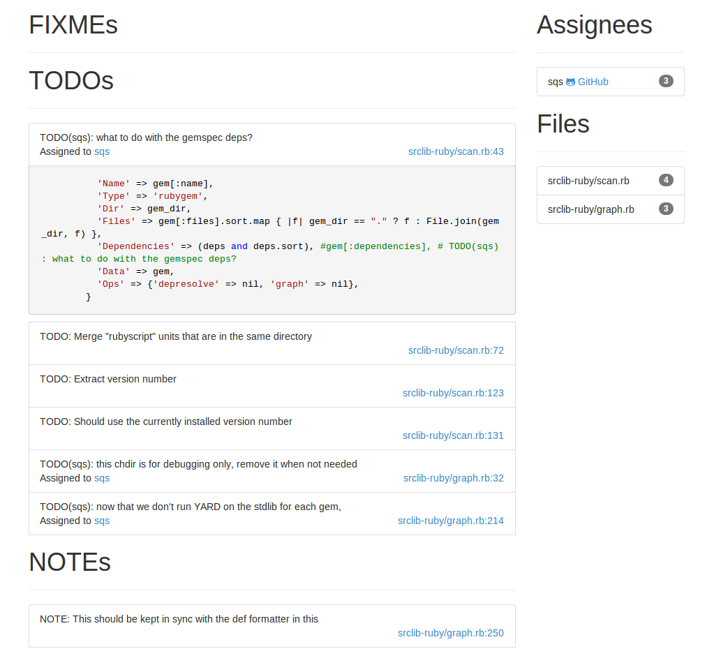

# Todo-List [](https://travis-ci.org/rameshvarun/todo-list)

Todo-list starts a server to find TODOs, FIXMEs, and NOTEs,
presenting them in an interface that lets you sort by assignee
and file. The server will also show code snippets.



# Using as an Application
Todo-list can be installed and used as an application.
```
npm install -g todo-list
```

Then navigate to your code directory, and run the following command.

```
todo-list
```

You should be able to navigate your browser to `http://localhost:3000/` and see the
results.

# Using as a Library
```javascript
var todolist = require("todo-list");
todolist.findMarks("// TODO(bob): This is a TODO assigned to bob.");
/*[{
	content: 'TODO(bob): This is a TODO assigned to bob.',
	line: 0,
	assignee: 'bob',
	type: 'TODOs'
}]*/
```
